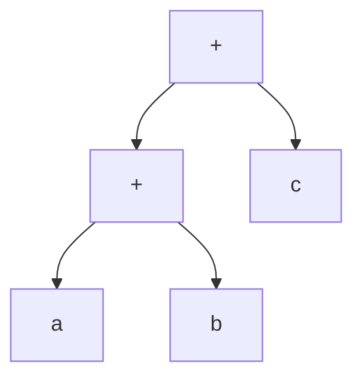
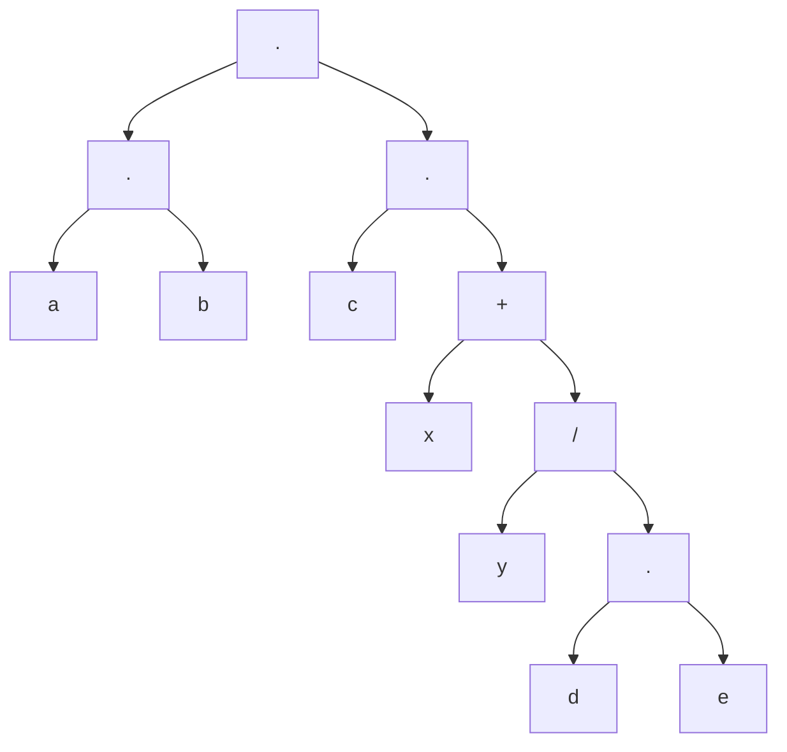
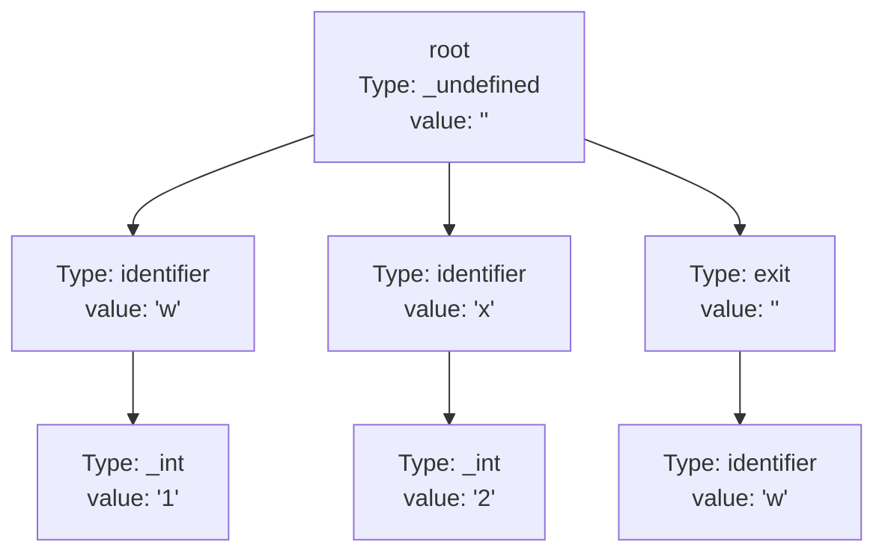

# General Syntax

All lines must end with a semi colon. 

Loo ignores all white space except if the white space separates between keywords/variables.

# Main Function/Entry Point for Execution

The compiler will automatically put all the code in a `.loo` file under a main function, `_start` in x86_64 assembly.

# Declaring Integers

`int <variable name> = <Math statement or integer>;`

This will initalize a variable and push it to the stack.

# Math
Order of operations will be conducted (BEDMAS). Note that exponents is not supported in math expressions.

`mathParser.cpp:parse()` will parse a mathematical expression by making a tree as if the expression is the inorder traversal, ensuring operations higher on the order of precedence is inserted towards the bottom of the tree.

## Example 1

Sample with $a+b+c$ written as `a+b+c`:



## Example 2

Sample with $a\times{b}\times{c}\times{(x+\dfrac{y}{d}\times{e})}$ written as `a*b*c*(x+y/d*e)`:



# Tree Generation for Keywords

Every program will have a dummy root where the compiler will start when parsing or generating assembly code.

Generation of the tree occurs in `parser.cpp:parse()` with all mathematical statements appended to the same tree (where ever appropriate).

Every node in the tree contains a vector of child nodes, has descriptors (type) about its node type and the value it holds (if any). The root node is always created when the compiler runs and is given a type of `_undefined`.

In the tree, only keywords and variable names are ever inserted into the tree (mathematical statements with operands and integer literals are also inserted but generated in `mathParser.cpp:parse()`). 

Note, the order of the vector at the root node matters and code will start executing from index 0 in the vector.

## Example

For this code:

```
int w = 1;
int x = 2;
exit(w);
```
the following tree is generated:

where `_int` refers to an integer literal, `identifier` refers to a variable type, `exit` refers to the exit statement.

# Exit Statement

Exiting Program: `exit(<Math statement or integer>);` to exit the program with code evaluated in the brackets.

Loo does not require you to have an exit statement at the end of the program. A program without an exit statement will automatically be generated with an exit code of 0.

## Example 1 

```
exit(100);
```

will exit the program with exit code 100.

## Example 2

```
int y = 5 + 2*1;
exit(y + 1*2 + 1);
``` 
will exit the program with exit code 10.

## Example 3 

```
int y = (5+2)*1;
exit(y);
```
will exit the program with exit code 7.

## Example 4

```
int x = 5*2;
int y = 2026;
int ece = 1134;
```

will exit the program with exit code 0.

## Example 5

```
int x = 1;
int y = 2;
exit(x);
exit(y);
```

will exit the program with exit code 1.
