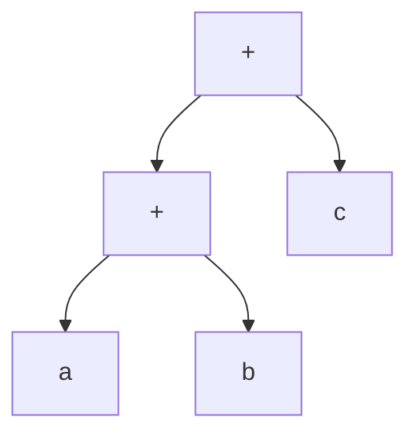
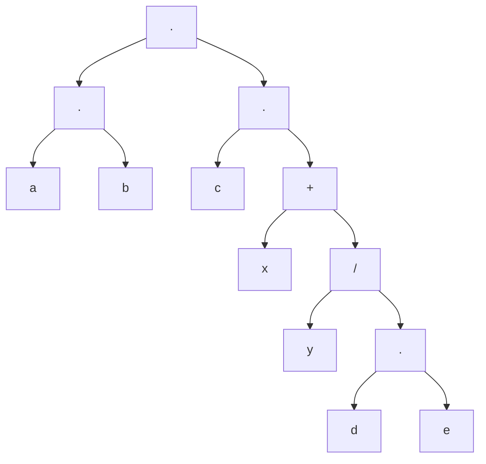

# Return Statement
$$
\begin{align}
[\text{exit}] \to \text{exit}([\text{expr}]);

\\
[\text{expr}] \to 
\begin{cases}
    \text{int}\\
    \text{identifer}
\end{cases}
\\
\text{identifer} \to \text{int}\\
\end{align}

$$

# Math
Order of operations will be conducted (BEDMAS).

`mathParser.cpp:parse()` will parse a mathematical expression by making a tree as if the expression is the inorder traversal.

## Example 1

Sample with $a+b+c$ written as `a+b+c`:

## Example 2

Sample with $a\times{b}\times{c}\times{(x+\dfrac{y}{d}\times{e})}$ written as `a*b*c*(x+y/d*e)`:

